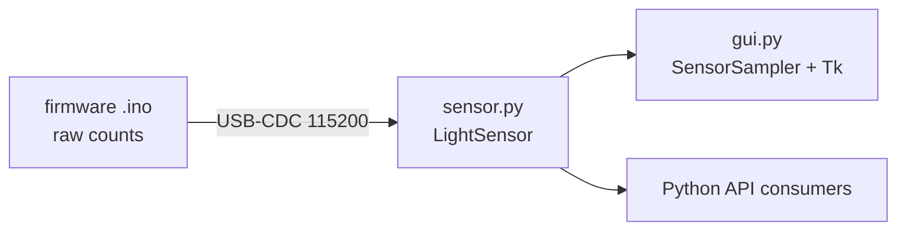

# Repository Guidelines

Driver, debug GUI, and firmware for a precision calibrated light sensor: a custom PCB (OPA323 op-amp + ADS1115 16-bit ADC over I2C) read by an ESP32-C3 SuperMini. The firmware returns **raw ADC counts only**; all physics/unit conversion happens host-side in Python. Work in progress — absolute calibration numbers are placeholders pending a reference measurement (`TODO.md`).

## Architecture & Data Flow

Three layers over one USB-CDC serial link at **115200 baud**:

1. **Firmware** (`firmware/lightsensor/lightsensor.ino`, Arduino/ESP32-C3) — owns the ADS1115 over I2C (addr `0x48`, SDA=GPIO10, SCL=GPIO21, 860 SPS) and a LittleFS partition (`/cal.csv`). Flat single-char command loop. Returns raw signed-16-bit counts + two saturation flags; no unit conversion. Firmware is the **source of truth** for the gain table and saturation voltage (reported via `I`).
2. **Driver** (`lightmeter/sensor.py`) — the `LightSensor` class wraps the serial protocol. All derivation lives here: counts→voltage, gain bookkeeping, dark-offset (`zero`), autogain, calibration parse/transfer. `lightmeter/port_detect.py` does cross-platform port autodetection (VID/PID `0x303A`/`0x1001`, then description hints, then sole-port fallback).
3. **GUI** (`lightmeter/gui.py`) — Tkinter app. A daemon `SensorSampler` thread does serial I/O; the Tk redraw loop runs at ~33 fps (`REFRESH_MS=30`), decoupled. Records to `recordings/rec_*.csv` (git-ignored).



### Serial protocol (single-char commands)
`r<n>` read n-averaged sample → `<raw>,<sensor_sat>,<adc_sat>` · `g<i>`/`G` set/get gain 0–5 · `p`→`pong` · `I` identity (`proto`, `fw`, `id`=MAC, `sps`, `vsat`, `gains`) · `W<n>`+bytes write calibration (CRC32-verified) · `C` read calibration · `H` size · `X` erase. Errors: `err <code>`, codes 1–7 mirrored in `ERR_MESSAGES`.

## Key Directories

- `lightmeter/` — Python package: `sensor.py` (driver), `gui.py` (Tkinter app + `main`), `port_detect.py`, `data/` (bundled `calibration_bpw34_typical.csv` fallback).
- `firmware/lightsensor/` — the `.ino` sketch (must sit in a same-named dir — Arduino rule).
- `tests/` — `test_calibration.py` (pure, no hardware), `test_read.py` (needs the device).
- `docs/` — `reference.md` (protocol, driver API, calibration model, hardware notes) + component datasheets.
- `recordings/` — GUI CSV output (git-ignored). `data/` — `calibration_dummy.csv` test fixture.

## Development Commands

```bash
uv sync                            # install deps (Python >=3.13)
just flash                         # compile + upload firmware (port auto-detected)
just compile                       # compile only (arduino-cli)
uv run python -m lightmeter.gui    # debug GUI (or: lightmeter). --port/--baud/--interval to override
uv run tests/test_read.py          # smoke test: connect, read 10 samples (NEEDS hardware)
uv run tests/test_calibration.py   # unit tests for conversion math (no hardware)
uv run ruff check                  # lint (line-length=100)
uv build                           # build wheel -> dist/lightmeter-0.1.0-py3-none-any.whl
```

FQBN: `esp32:esp32:esp32c3:CDCOnBoot=cdc` (native USB-CDC required). Arduino CLI/core setup in `docs/reference.md`.

## Code Conventions & Common Patterns

- **Formatting/lint:** Ruff, `line-length=100`, defaults otherwise. Python ≥3.13.
- **Naming:** dataclasses/classes PascalCase (`LightSensor`, `Reading`, `Calibration`, `DeviceInfo`); functions/attrs `lower_snake`; private prefixed `_` (`_lock`, `_zero_offset_v`, `_run`); constants UPPER (`GAIN_VOLTAGES`, `DEFAULT_GAIN`, `SATURATION_VOLTAGE`, `PROTO_VERSION`).
- **Units:** **voltage is the canonical unit** — driver, GUI, and recordings store true volts so data survives gain changes. Convert via `value * GAIN_VOLTAGES[gain] / 100`; never carry gain-relative or percent numbers in storage.
- **Error handling:** logging-first. Parse failures log at DEBUG, protocol/CRC issues at WARNING; methods return `None`/`False` rather than raise. Link errors raise unless `auto_reconnect=True` (then `read()` calls `reconnect()` and returns `None`).
- **Threading:** driver guards every serial transaction with a `threading.RLock` (re-entrant — high-level methods nest low-level reads). GUI `SensorSampler` uses `Event`/`Lock` + deques; GUI thread only reads via a thread-safe snapshot.
- **No DI/heavy abstraction** — plain classes, module-level functions (`best_gain`, `daylight_spectrum`, `luminous_efficacy`, `parse_calibration`, `autodetect_port`).

### Invariants (easy to break)
- **Dark offset is applied last** (display only), stored in volts, and never feeds gain/saturation logic. `read()` runs autogain + saturation flags on the true un-zeroed level, then subtracts the offset.
- **Two mutually-exclusive saturation modes:** `sensor_sat` (OPA323 rail, gains 0–1, >~3.266 V) vs `adc_sat` (counts hit 32767, gains 2–5). Both come from firmware per reading.
- **Calibration transfer is throttled (128-byte chunks + ~2ms pauses) and CRC32-verified** (`binascii.crc32` ↔ firmware). Don't collapse `write_calibration` into one burst — it overruns the device RX buffer.
- **Reconnect/resync:** a cleanly-closed port reopens transparently; on desync stay silent past `DEVICE_CMD_TIMEOUT` (5s) so a stuck command self-aborts — never re-ping mid-timeout.

## Important Files

- `lightmeter/sensor.py` — `LightSensor` (API: `read`, `reading_voltage`, `read_physical`, `set_gain`/`get_gain`, `zero`/`clear_zero`, `autogain*`, `load/read/write/clear_calibration`, `reconnect`, `identify`); `Reading`, `Calibration`, `DeviceInfo`.
- `lightmeter/gui.py` — `SensorSampler` (sampler thread), `SensorApp` (Tk UI), reusable `save_recording`/`open_recording_plot`, `main()` (argparse `--port`/`--baud`/`--interval`). Entry point `lightmeter = lightmeter.gui:main`.
- `lightmeter/__init__.py` — public exports.
- `firmware/lightsensor/lightsensor.ino` — `PROTO_VERSION`/`FW_VERSION`, command loop, ADS1115 + LittleFS.
- `pyproject.toml`, `justfile`, `.python-version`, `docs/reference.md`, `CLAUDE.md`, `TODO.md`.

## Runtime/Tooling Preferences

- **Package manager: `uv`** (lockfile `uv.lock`). Run Python via `uv run ...`; Python pinned to **3.13** (`.python-version`).
- Runtime deps: `matplotlib>=3.10.9`, `pyserial>=3.5`. Build backend: `hatchling`.
- Firmware tooling: `arduino-cli` driven through `just` recipes; ESP32 core + `ADS1X15` lib (see `docs/reference.md`).

## Testing & QA

- **Hand-rolled runner, NOT pytest.** `test_calibration.py` defines `run()` (collects `test_*` from globals, executes, prints `ok`/summary) and an `approx(a, b, tol)` helper. Add tests as `def test_*():` functions in the same file.
- `test_calibration.py` is pure (calibration/conversion math, uses `data/calibration_dummy.csv`) and runs anywhere. `test_read.py` requires the ESP32-C3 connected (reads 10 samples, reports value %/saturation/throughput).
- No coverage tooling configured. Run `uv run ruff check` before yielding. Test conversion behavior and invariants (gain-relative voltage, dark-offset ordering, CRC verification, out-of-band calibration returning `None`), not plumbing.

## Hardware Gotchas

100 kHz I2C (400 kHz failed on this wiring), 860 SPS, ~330 reads/s single-shot ceiling (ALERT/RDY tied to ground). **Never exceed 3.6 V on an ADS1115 input.** OPA323 saturates ~3.266 V. Native USB-CDC (no DTR/RTS reset); a stuck port clears with an RTS pulse or replug. Slow uncharacterized thermal downward drift observed (`TODO.md`).
